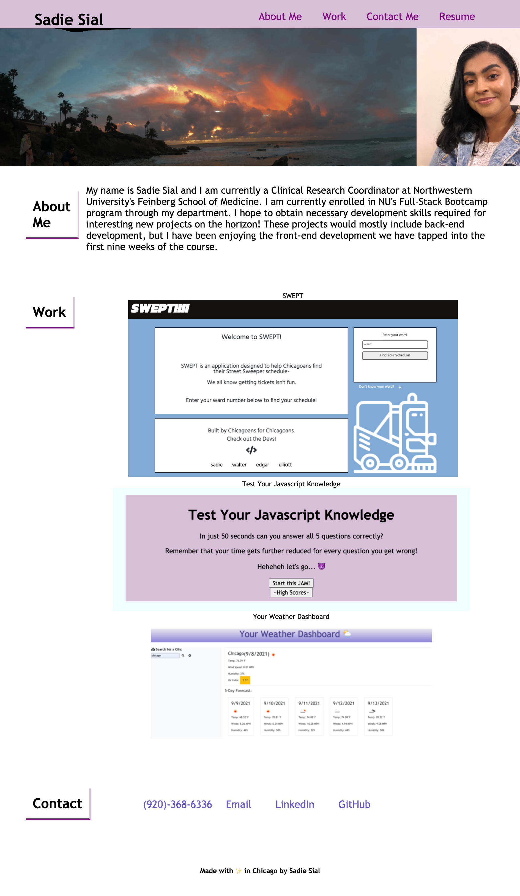

# Professional Portfolio (Bootcamp Assignment 2 - Advanced CSS)
---
By: Sadie Sial
___

## User Story

```
AS AN employer
YOU WILL view a potential employee's deployed portfolio of work samples
SO THAT you can review samples of their work and assess whether they're a good candidate for an open position
```

```
This application allows for a "visually appealing" portfolio to launch, and then guide the viewer through the potential employee's previous work samples and contact information.
```

## Screenshot of Portfolio
```
Web Display
```


```
Mobile Display
```


## Links

- [Deployed App](https://sadielinks.github.io/professional-portfolio/)

- [GitHub Repository](https://github.com/sadielinks/professional-portfolio)


## Technologies Used
- HTML + CSS


## Contact Information

- [GitHub Profile](https://github.com/sadielinks)
- [Email](mailto:sadiecodes@gmail.com)

My name is Sadie Sial and I am taking this Full-Stack Coding Bootcamp through my current employer.


## License

This source code is available to everyone under the standard [MIT License ©](https://github.com/microsoft/vscode/blob/master/LICENSE.txt). <br>

© 2021 Trilogy Education Services, LLC, a 2U, Inc. brand. Confidential and Proprietary. All Rights Reserved.