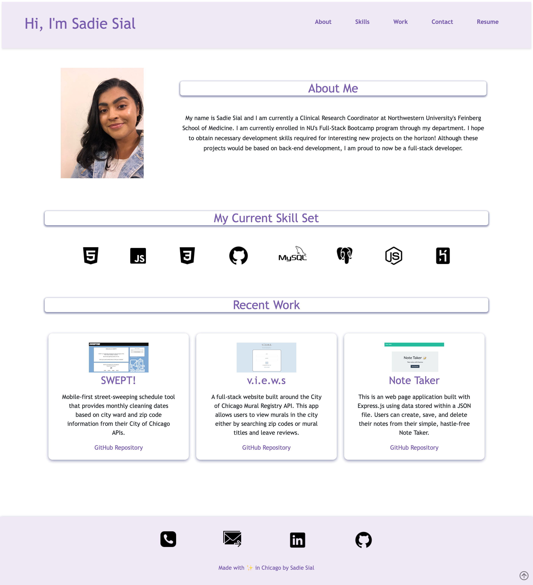

# Professional Portfolio (Bootcamp Assignment) 

By: Sadie Sial
___


#### Table of Contents

* [Description](#description)
* [Screenshots](#screenshots)
* [Technologies](#technologies)
* [Links](#links)
* [Contact](#contact)
* [Previous](#previous)
* [License](#license)

## Description

This application allows for a "visually appealing" portfolio to launch, and then guide the viewer through the potential employee's previous work samples and contact information.


### User Story

```
AS AN employer
YOU WILL view a potential employee's deployed portfolio of work samples
SO THAT you can review samples of their work and assess whether they're a good candidate for an open position
```

## Screenshots
```
Desktop Display
```



```
Mobile Display
```


## Technologies Used
- HTML
- CSS
- Javascript <br>

## Links

- [Deployed App](https://sadielinks.github.io/professional-portfolio/)

- [GitHub Repository](https://github.com/sadielinks/professional-portfolio) <br>


## Contact Information

- [GitHub Profile](https://github.com/sadielinks)
- [Email](mailto:sadiecodes@gmail.com)

My name is Sadie Sial and I am taking this Full-Stack Coding Bootcamp through my current employer. <br>

## Previous Versions

```
v-2.0 Desktop Display
```


```
v-1.0 Desktop Display
```


```
v-2.0 Mobile Display
```


## License

This source code is available to everyone under the standard [MIT License ©](https://github.com/microsoft/vscode/blob/master/LICENSE.txt). <br>

© 2021 Trilogy Education Services, LLC, a 2U, Inc. brand. Confidential and Proprietary. All Rights Reserved.